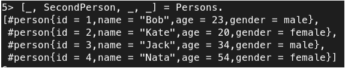
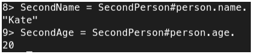
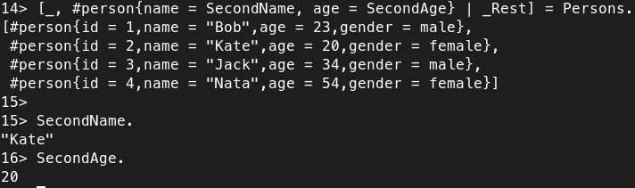
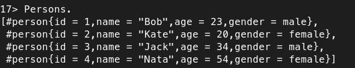
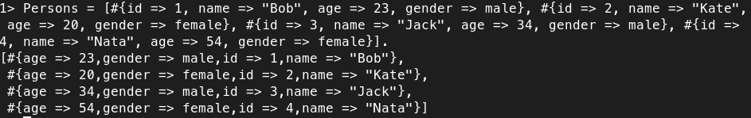
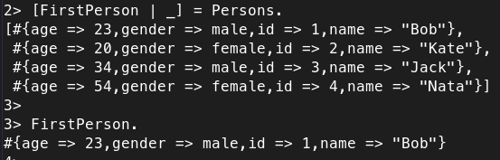
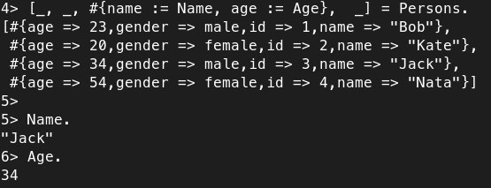
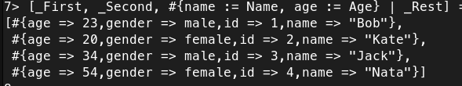
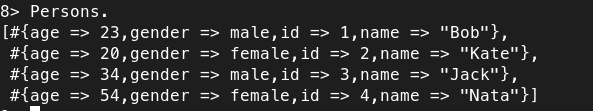
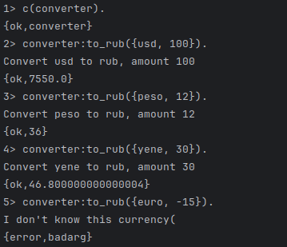

# 1
1.

Извлекаем второй элемент списка рекордов, остальное игнорируем.

2.

   
Извлекаем элементы рекорда SecondPerson по ключам.

3.

Сопоставление с образцом проходит успешно потому что мы матчим имя и возраст второго рекорда, которые раннее были извленчены из Persons.

4.

Persons не изменился

# 2

1.

Голова Persons присвоилась FirstPerson

2. 

Переменным Name и Age присвоились значения ключей "name" и "age" третьей мапы с помощью паттерн матчинга

3.  

Связанные Name и Age сматчились с третьей мапой списка Persons

4.

Persons не изменился

# 3

В последний строке выводится ошибка, потому что во всех функциях мы используем guard, который проверяет Amount на целочисленность и положительность